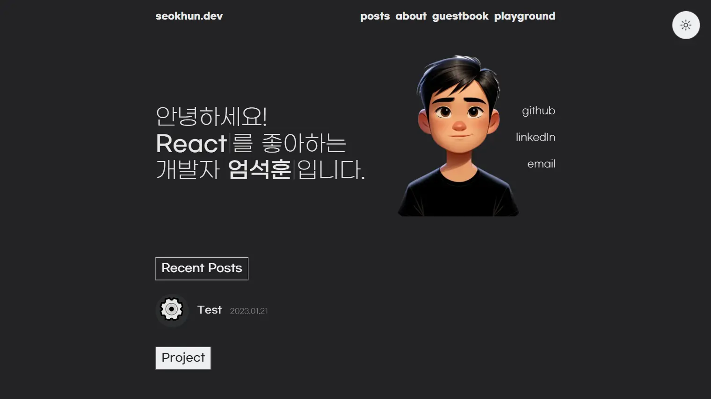
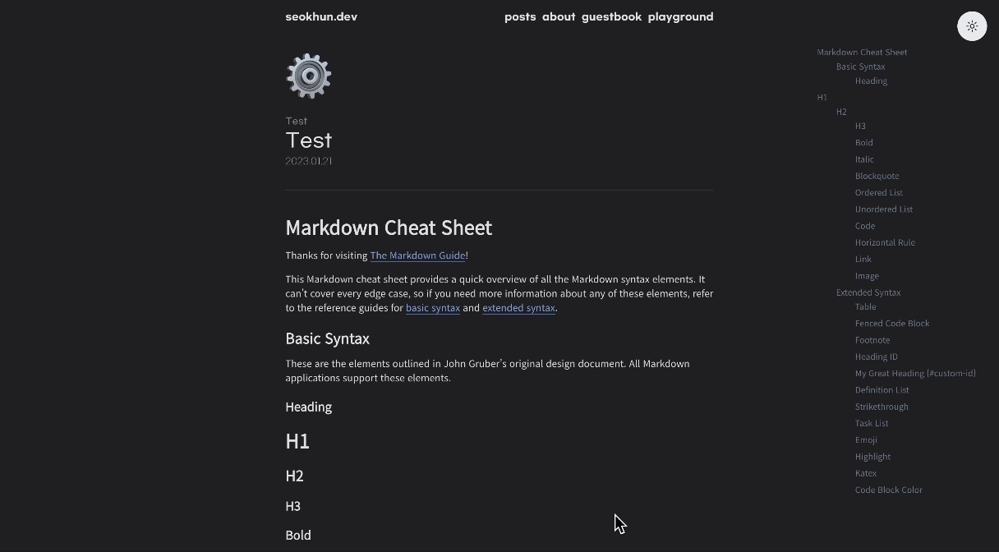
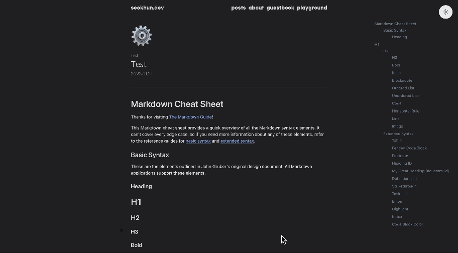
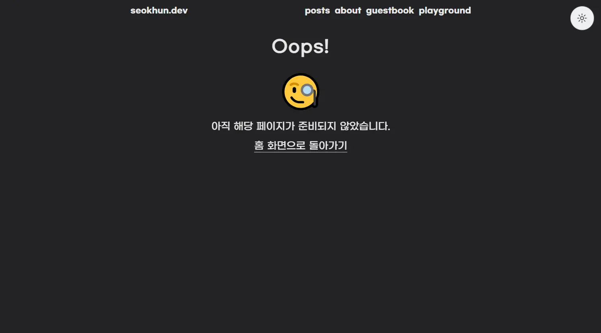
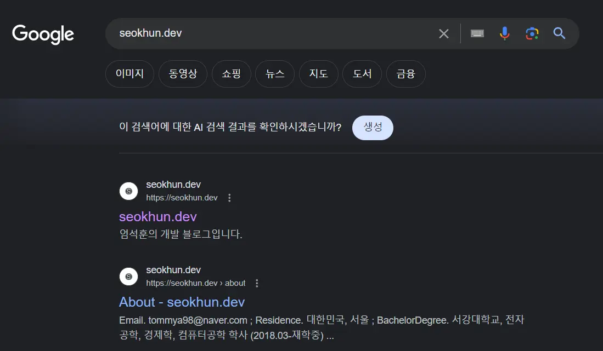

## 개발 블로그?


DALL·E로 만든 이미지

최근 다양한 회사나 개인들이 개발 블로그를 운영하고 있습니다. 다양한 이유가 있겠지만 주된 이유는 자신을 브랜딩하며 자신의 경험을 문서화하고 공유하기 위함이 가장 큰 이유라고 생각합니다.

이번 블로그를 만들게 된 계기도 위와 동일합니다. 경험을 기록하고 나 자신을 보다 어필하기 위해서 개발 블로그 구축을 시작하게 되었습니다.

<br>

### 블로그를 어디에 만들 것인가?

이번 블로그를 만드는 과정에서는 일말의 고민 없이 웹페이지를 직접 구축하고 만들어 봐야겠다고 생각했습니다. 직접 블로그를 만드는 과정에서 배울 점이 많을 것이라 생각하였고 나만의 블로그라는 특별한 의미를 더 담아 오랫동안 내 자식처럼 관리할 것이라는 기대감으로 직접 구축을 시작했습니다.

<br>

### 어떤 기술을 쓸 것인가?

블로그를 만들 때 Jekyll과 Gatsby, Next.js를 고려하였으나 Jekyll은 Ruby 기반으고 나머지는 React 기반으로 보다 익숙하고 학습에 도움이 될것이라 생각해 Jekyll은 배제하였습니다.

다음으로 블로그의 특성상 서버와의 상호작용이 필요없고 정적인 페이지만 보여주면 되기 때문에 서버 없이도 동작할 수 있는 정적 페이지 생성에 보다 적합하다고 생각한 Gatsby를 선택하였습니다. 또한 Gatsby는 SEO 최적화가 잘 되어 있고 다양한 플러그인을 조합하여 원하는 기능을 포함시킬 수 있다는 편리함도 있어 선택하게 되었습니다.

<br>

### 배포는 어떻게 할 것인가?

처음에는 github pages의 배포를 고려하였습니다. 하지만 Gatsby 공식 홈페이지에서 Netlify에서 배포하라고 추천하고 있고 찾아본 결과 쉽고 무료로 배포할 수 있다고 하여 선택하였습니다.

> 결론적으로 배포가 쉽고 간단하여 정말 만족합니다.

<br>
<br>

## Gatsby로 블로그를 만들어보자

Gatsby는 리액트 기반으로, 리액트처럼 컴포넌트 기반으로 코드를 작성할 수 있다는 장점이 있지만 플러그인이나 GraphQL등을 추가로 공부해야 하는 부분이 있습니다.

<br>

### 공식 문서로 학습하기

Gatsby를 처음 사용하다 보니 사용법을 익히기 위해서 공식 문서의 [Getting Started](https://www.gatsbyjs.com/docs/tutorial/getting-started/)를 통해 학습하였습니다. 공식 문서가 정말 잘 구성되어 있어 기본 동작과 GraphQL로 데이터를 가져오는 방법, 플러그인을 사용하는 방법 등을 익혔습니다.

<br>

### 템플릿 선택하기

디자인 감각이 없기도 하고 처음부터 블로그를 만들기에는 어려움이 있다고 판단되어 템플릿을 찾아 보았습니다.

- [gatsby-starter-blog](https://github.com/gatsbyjs/gatsby-starter-blog)
- [gatsby-starter-minimal-blog](https://github.com/LekoArts/gatsby-starter-minimal-blog)
- [gatsby-starter-apple](https://github.com/sungik-choi/gatsby-starter-apple)
- [gatsby-starter-bee](https://github.com/JaeYeopHan/gatsby-starter-bee)
- [danmin-gatsby-blog-template](https://github.com/danmin20/danmin-gatsby-blog-template)



완성된 템플릿의 디자인

총 5개의 템플릿 중에서 고민하였고 그 중에서 꼭 구현하고 싶었던 기능인 반응형 디자인, 다크 모드, 카테고리, 목차, 프로젝트를 전시할 수 있는 페이지가 다 포함되어 있는 [danmin-gatsby-blog-template](https://github.com/danmin20/danmin-gatsby-blog-template) 템플릿을 선택하였습니다.

<br>
<br>

## UI / UX 향상 시키기

기존 템플릿도 매우 훌륭하지만 일부 고치고 싶은 부분이나 보완하고 싶은 부분이 있어서 간단하게 코드를 작성하였습니다.

<br>

### 목차 스크롤 수정하기

기존 템플릿에서는 포스트에서 목차를 사용해서 이동하는 경우 순식간에 페이지가 이동하고 해당 타이틀이 헤더 영역에 가려지는 위치로 이동하여 제대로 사용자 경험을 저해하고 있었습니다.



목차 스크롤 수정 전

이를 해결하기 위해 먼저 `html` 요소에 `scroll-behavior: smooth;` 속성을 적용하여 스크롤을 부드럽게 적용하였습니다. 다만 이때 전체 화면을 감싸는 `Layout` 컴포넌트가 `position: fixed;` 속성을 가지고 있어 스크롤을 위한 화면 `overflow` 가 없는 문제가 있어 이 속성을 삭제해 주었습니다. 그 결과 스크롤이 부드럽게 이동하도록 만들 수 있었습니다.

다음으로 이동하였을 때 헤더 영역에 가려지는 위치로 이동하는 문제를 해결하기 위해서 목차를 클릭하였을 때 `a` 태그를 이용해서 자동으로 이동하는 것이 아니라 이동할 요소의 위치를 찾고 해당 위치에서 헤더의 크기만큼 덜 이동하도록 하였습니다.

이때 `useRef` 로 돔 요소를 선택하고 `useEffect` 에서 목차가 화면에 그려진 후 모든 목차에 각각 이벤트 리스너를 등록하도록 `useTocScroll` 훅을 작성하였습니다.

```tsx
const OFFSET = 60;

const useTocScroll = () => {
  const contentRef = useRef<HTMLDivElement>(null);

  useEffect(() => {
    const contentElement = contentRef.current;
    if (!contentElement) return;

    const handleClick = (e: MouseEvent) => {
      const clickedElement = e.currentTarget as HTMLElement;
      if (clickedElement.tagName !== "A") return;

      const href = clickedElement.getAttribute("href");
      if (!href || !href.startsWith("#") || href.startsWith("#fn-")) return;
      const adjustedHref = href.startsWith("#fnref-")
        ? href.replace("ref", "")
        : href;
      const targetAnchor = Array.from(
        contentElement.querySelectorAll("a")
      ).find(
        (anchor) => anchor.getAttribute("href") === adjustedHref
      ) as HTMLAnchorElement;

      if (targetAnchor) {
        e.preventDefault();
        const targetPosition =
          targetAnchor.getBoundingClientRect().top + window.scrollY;
        window.scrollTo({ top: targetPosition - OFFSET, behavior: "smooth" });
      }
    };

    const anchors = contentElement.querySelectorAll("a");
    anchors.forEach((anchor) => anchor.addEventListener("click", handleClick));

    return () => {
      anchors.forEach((anchor) =>
        anchor.removeEventListener("click", handleClick)
      );
    };
  }, []);

  return contentRef;
};
```

> 기존 마크다운의 링크를 건디리지 않기 위해 `href`를 확인하는 과정을 추가하였습니다.
> `#fn-`이나 `#fnref-`으로 시작하는 href는 마크다운의 Footnote를 위한 추가 코드입니다.

`targetAnchor` 를 구하는 과정에서 목차보다 마크다운 본문이 HTML 문서에서 더 먼저 나오기 때문에 `find` 함수를 사용해서 첫 번째 같은 href를 가지는 요소로 이동하도록 만들 수 있었습니다.



목차 스크롤 수정 후

그 결과 위와 같이 부드럽게 원하는 위치로 이동하는 목차를 구현할 수 있었습니다.

<br>

### 코드 블럭, 체크 박스, 이모지, Latex

마크다운 문서로 작성된 블로그 포스트가 읽기 좋고 다양한 기능을 추가하기 위해서 몇 가지 코드와 플러그인을 추가하였습니다.

> Gatsby는 다양한 플러그인이 제공되며 추가하기만 하면 적용되어 매우 편했습니다.

- 코드 블럭은 [gatsby-starter-bee](https://github.com/JaeYeopHan/gatsby-starter-bee)템플릿을 참고하여 스타일을 적용하였습니다.
- 체크 박스는 마크다운을 파싱해주는 gatsby-transformer-remark 플러그인에 의해 `<input type=”checkbox”>` 형태로 생성되고 `checked` 속성까지 포함되어 있어 CSS로 `checked` 인 경우에 가상 요소 선택자를 이용해 체크 표시를 추가하였습니다.
- 이모지는 gatsby-remark-emoji플러그인을 적용하였습니다.
- Latex문법은 gatsby-remark-katex플러그인을 적용하였습니다.

<br>
<br>

## 접근성 향상 시키기

블로그를 만들기만 하면 아무런 의미가 없습니다. 다른 사람이 쉽게 찾아올 수 있도록 하고 이와 관련된 부가적인 작업을 수행해야 합니다. 이를 위해 사이트의 메타 데이터를 설정하고 도메인을 등록하는 등 다양한 작업을 수행하였습니다.

<br>

### 사이트맵, 로봇, RSS, 오픈 그래프

구글과 같은 검색 엔진에서 블로그의 정보를 가져갈 수 있도록 Gatsby 플러그인을 추가하였습니다. 모든 기능들이 편하게 플러그인으로 구현되어 있어 가져와 설정만을 통해 쉽게 적용할 수 있었습니다.

- 사이트맵 플러그인
  - gatsby-plugin-sitemap
  - gatsby-plugin-advanced-sitemap
- robots.txt 플러그인
  - gatsby-plugin-robots-txt
- RSS 플러그인
  - gatsby-plugin-feed
- Open Graph 플러그인
  - gatsby-plugin-react-helmet

그리고 오픈 그래프를 적용하기 위한 gatsby-plugin-react-helmet 플러그인은 `<head>` 태그 안에 있는 메타 데이터를 설정할 수 있도록 도와주는 플러그인으로 이를 이용해 `<Seo>` 컴포넌트를 사용해 메타 데이터를 관리해 주었습니다.

<br>

### 404 페이지

블로그 내에서 잘못된 링크로 접근할 일은 거의 없겠지만 404 페이지는 기본이라고 생각하여 미니멀한 디자인으로 간단히 구성하였습니다. 404 페이지에 해당하는 컴포넌트를 만들기만 하면 Gatsby에서 자동으로 잘못된 주소로 접근하는 경우 보여주기 때문에 추가적인 설정은 필요 없었습니다.



간단한 404 페이지

<br>

### 도메인 등록하기

Netlify로 간단하게 배포를 진행할 수 있었지만 이 경우에는 도메인 주소가 https://seokhun-dev.netlify.app처럼 뒤에 불필요한 주소가 붙는 것이 마음에 들지 않았습니다. 따라서 요즘 개발자들 사이에서 많이 사용되는 .dev를 사용하기로 하였습니다.

도메인을 판매하는 사이트가 많지만 유명하고 규모가 큰 GoDaddy에서 구매했습니다. 그 이후 도메인의 네임서버를 Netlify에서 지시하는 대로 수정하고 구매한 도메인과 배포된 사이트를 연결하였습니다.

<br>

### 웹마스터 등록 및 GA

마지막으로 검색 엔진에서 블로그를 검색했을 때 검색이 되도록 구글과 네이버 웹마스터에 등록하는 과정을 거쳤습니다.



구글 검색 결과

그리고 gatsby-plugin-google-gtag를 이용해 구글에서 제공하는 분석기를 간단히 연결할 수 있었습니다. 아직은 별 내용은 없지만 나중에 글을 작성하고 어떤 포스트가 블로그에 유입을 많이 이끌어 오는지 확인할 수 있을 것 같다.

<br>
<br>

## 블로그를 만들고 난 후

블로그를 직접 만들고 직접 배포하고 기타 작업까지 수행하며 나름대로 하나의 프로젝트를 완료했다는 생각이 들어 뿌듯합니다. 물론 앞으로 계속해서 유지 보수하고 블로그를 만든 의미대로 블로그 글도 계속해서 작성하는 것이 가장 중요하다고 생각됩니다.

추후 블로그 글이 많아져 초기 렌더링에 딜레이가 생기면 무한 스크롤을 적용하고 싶은 마음이 있습니다. 또한 검색 기능도 추가하여 원하는 글을 빠르게 찾을 수 있도록 만들고 싶습니다.

```toc

```
