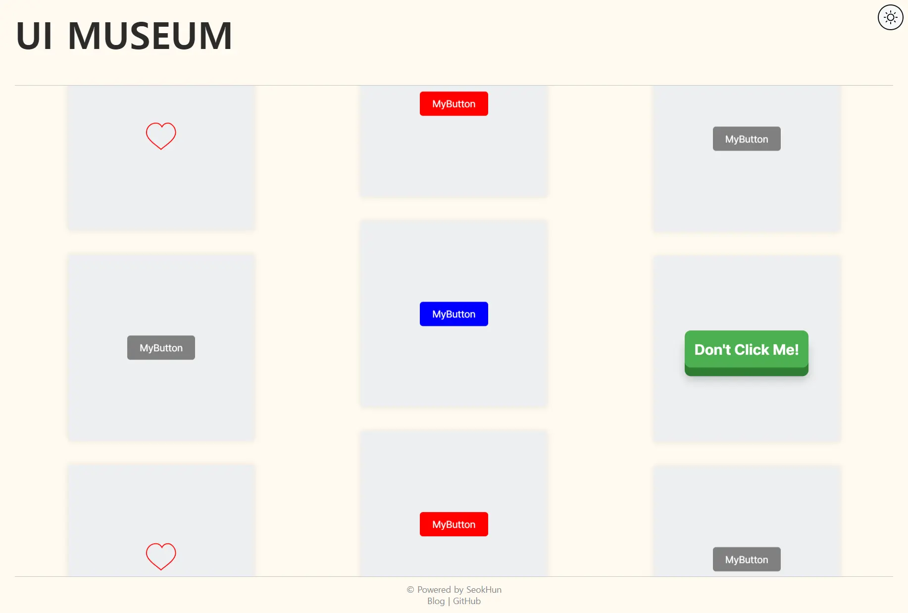
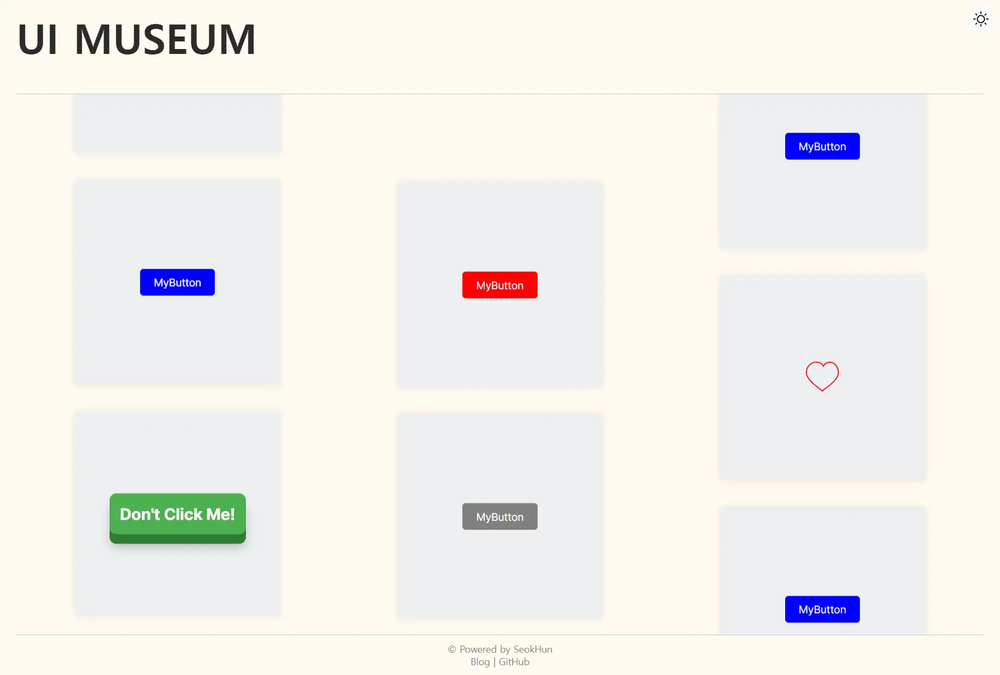
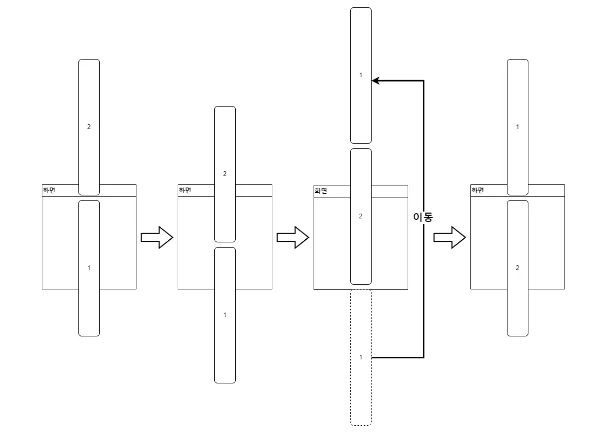
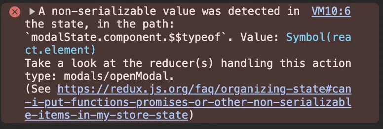
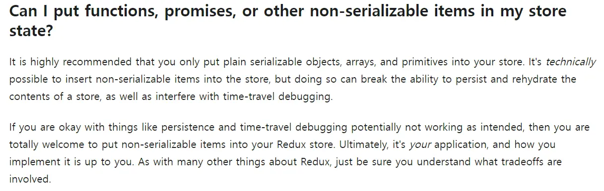
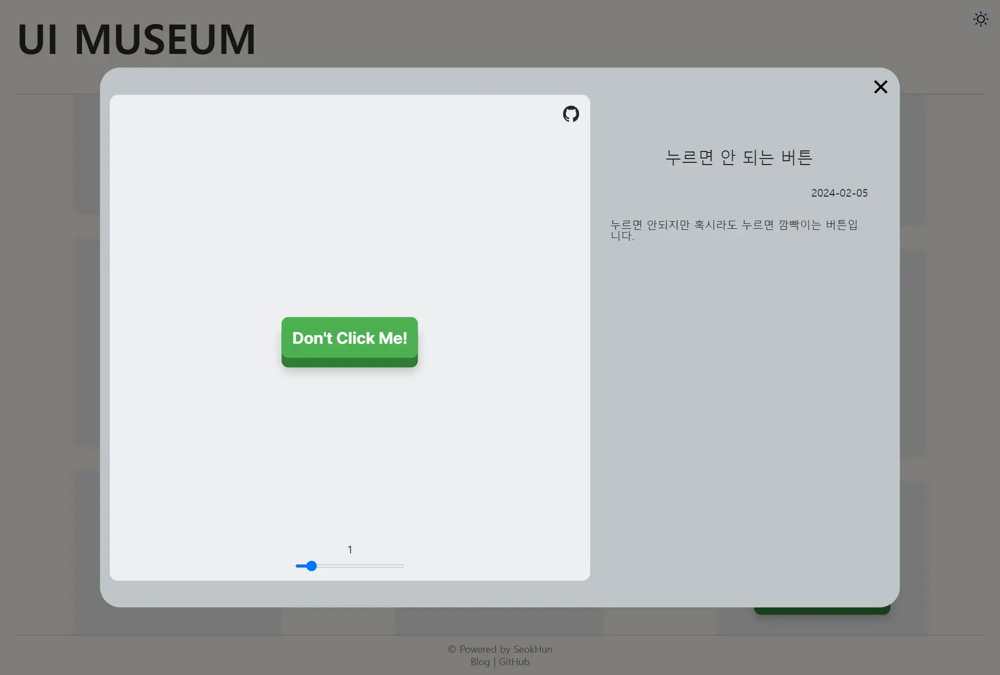

## UI-MUSEUM 프로젝트



간단한 디자인의 UI-MUSEUM 페이지

UI-MUSEUM은 내가 만든 리액트 컴포넌트를 전시할 수 있는 웹사이트입니다. 핵심 기능으로는 여러 컴포넌트를 자동으로 보여주기 위한 수직 무한 롤링 배너[^1]와 모달을 통한 상세 보기가 있습니다.

<br>

### 프로젝트 동기

UI-MUSEUM이라는 프로젝트는 리액트로 개발하면서 직접 만들게 된 컴포넌트들을 해당 프로젝트에서만 사용하기에는 아쉬운 경우가 있어 이를 공유하고 싶어 시작하게 되었습니다. 물론 스토리북과 같은 훌륭한 대체재도 고려할 수 있지만, 언제든지 필요한 기능을 추가하고 원하는 형태로 보여주기 위해서 프로젝트를 시작하게 되었습니다.

프로젝트의 독창성을 더하고 점점 많아질 컴포넌트를 큐레이션하여 자연스럽게 보여주기 위해 무한 롤링 배너를 도입하게 되었습니다. 그리고 사용자가 직접 스크롤을 하는 대신 스크롤을 내려주는 느낌을 주기 위해 일반적인 롤링 배너의 방향인 수평 대신 수직 롤링 배너를 선택하여 프로젝트를 시작하였습니다.

<br>

### 기술적 도전

프로젝트의 핵심 기능인 수직 무한 롤링 배너를 만드는 것이 첫 번째 도전이었습니다. 수평의 경우는 deprecated된 HTML의 `<marquee>`태그와 유사하게 동작하는 여러가지 라이브러리가 있지만 수직의 경우는 원하는 형태로 동작하는 것을 찾기 어려워 직접 구현해야 했습니다.

다음으로, 선택된 컴포넌트를 모달로 띄워주기 위한 여러 방법 중에서, 하나의 모달에 컴포넌트 정보를 전달해 띄우는 방식을 사용하였습니다. 이를 위해서는 모달과 메인 화면이 컴포넌트 데이터를 주고 받아야 했고, 이를 위한 상태관리가 필요했습니다.

<br>
<br>

## 수직 무한 롤링 배너

극장이나 공연장의 큰 천막을 의미하는 'marquee(마키)'는 시간이 흐르며 전광판을 거쳐 웹에서 흐르는 텍스트를 표현하는 `<marquee>` 태그로 발전했으나 현재는 사용되지 않습니다. 이 기능을 대체하는 다양한 라이브러리가 존재하지만, 수직으로 완벽하게 동작하는 찾기는 어려웠습니다. 이에 직접 도전하여 수직 무한 롤링 배너 개발을 시작했습니다.

<br>

### 첫 번째 시도 with JS

```tsx
import { useState, useEffect, useRef } from "react";
import addChildEventListener from "./src/utils/addChildEventListener";

export type TDirection = "up" | "down";

const useMarquee = (direction: TDirection, speed: number) => {
  const containerRef = useRef<HTMLDivElement>(null);
  const [isPaused, setIsPaused] = useState(false);
  const lastPosition = useRef(0);
  const lastAnimationFrameTime = useRef(Date.now());

  const handleMouseEnter = () => setIsPaused(true);
  const handleMouseLeave = () => {
    lastAnimationFrameTime.current = Date.now();
    setIsPaused(false);
  };

  const { addChildEvents, removeChildEvents } = addChildEventListener([
    { eventType: "mouseenter", handler: handleMouseEnter },
    { eventType: "mouseleave", handler: handleMouseLeave },
  ]);

  useEffect(() => {
    const container = containerRef.current;
    if (!container) return;

    const marquees = Array.from(container.children) as HTMLElement[];
    let animationFrameId: number;

    const animate = () => {
      if (isPaused) return;

      const currentTime = Date.now();
      const deltaTime = currentTime - lastAnimationFrameTime.current;
      lastAnimationFrameTime.current = currentTime;

      const movement = (speed * deltaTime) / 16;
      lastPosition.current += direction === "up" ? -movement : movement;

      const maxPosition = marquees[0].clientHeight;
      if (Math.abs(lastPosition.current) >= maxPosition) {
        lastPosition.current = 0;
      }

      marquees.forEach((marquee) => {
        marquee.style.transform = `translateY(${lastPosition.current}px)`;
      });

      animationFrameId = requestAnimationFrame(animate);
    };

    animationFrameId = requestAnimationFrame(animate);
    addChildEvents(marquees);

    return () => {
      cancelAnimationFrame(animationFrameId);
      removeChildEvents(marquees);
    };
  }, [direction, speed, isPaused]);

  return containerRef;
};

export default useMarquee;
```

첫 시도는 `useMarquee`라는 커스텀 훅을 사용하여 요소를 포함하는 컨테이너의 크기를 동적으로 측정한 후, `requestAnimationFrame`을 사용해 컨테이너의 모든 자식 요소의 `translateY`를 조절하여 흐르는 효과를 만들었습니다. 또한, 마우스 호버 시 애니메이션을 멈추기 위해 애니메이션의 프레임 시간과 위치를 저장했다가 복원하는 방식을 구현했습니다.



이런 식으로 위에는 빈 공간이 존재하게 된다.

위의 방법은 아래에서 위로 흐르는 애니메이션에 잘 적용되었지만, HTML요소가 기본적으로 아래에서 위로 배치되기 때문에, 위에서 아래로 흐르는 애니메이션을 적용할 때는 코드를 그대로 사용할 수 없었습니다. 이 문제를 해결하기 위해 방향에 따라서 `translateY`에 요소의 크기만큼 값을 추가하는 방식을 고려했으나, 코드가 점점 복잡해지는 문제에 직면했습니다.

<br>

### 두 번째 시도 with CSS



애니메이션의 동작 원리

이에 따라, CSS의 `animation`을 사용하는 방법으로 전환했습니다. 자연스러운 무한 롤링 배너를 만들기 위해 2개의 배너를 사용하고, 각 배너가 이어져 흐르며 화면에서 벗어나면 다시 뒤에 배치하는 방식으로 애니메이션을 구현했습니다.

내려가는 애니메이션을 예시로 들면 위의 그림과 유사하게 동작합니다. 물론 1번 배너가 화면에서 안 보이는 순간 위로 올라가는 것은 아니고 요소의 높이만큼 움직인 이후에 위로 올라가게 됩니다.

```tsx
const moveDown = (contentHeight: number, wrapperHeight: number) => keyframes`
  0% {
    transform: translateY(${wrapperHeight - 2 * contentHeight}px);
    opacity: 1;
  }
  50% {
    transform: translateY(${wrapperHeight - contentHeight}px);
    opacity: 1;
  }
  50.01% {
    transform: translateY(${wrapperHeight - 3 * contentHeight}px);
    opacity: 0;
  }
  51%{
    opacity: 1;
  }
  100% {
    transform: translateY(${wrapperHeight - 2 * contentHeight}px);
    opacity: 1;
  }
`;
```

내려가는 애니메이션을 구현할 때, 위 코드와 같이 50%까지는 아래로 내려가고 50.01%에서 순간적으로 위로 올라가 다시 100%까지 내려가도록 설정했습니다. 이 과정에서 Emotion 라이브러리를 사용해 요소의 높이를 기반으로 `keyframes`를 동적으로 생성했습니다.

그리고 순간적인 이동이 시각적으로 감지되는 것을 방지하기 위해, 이동하는 순간인 50.01%에서 `opacity`를 0으로 설정하여 화면에 보이지 않도록 했습니다.

<br>

### 최종 구현 결과 및 배운 점

결국, CSS를 사용하는 방법으로 최종 구현을 완료했습니다. JS를 사용해 `useMarquee` 코드를 조금 더 개선하는 것도 가능했지만, CSS를 활용하는 것이 유지 보수와 확장성 면에서 더 간단하고 우수하다고 판단했습니다.

이 과정에서 무조건 JS를 사용해서 제어하는 것보다 CSS를 활용할 수 있는 영역이라면 이를 활용하는 것이 더 효율적이고 간단할 수 있다는 점을 배울 수 있었습니다.

<br>
<br>

## 그 외 구현사항

수직 무한 롤링 배너 외에도 프로젝트에 포함된 주요 구현 사항으로 리덕스를 사용한 상태 관리와 모달에 적용한 애니메이션 기능이 있습니다.

<br>

### 리덕스

이번 프로젝트는 규모가 작음에도 불구하고, 리덕스를 사용하여 상태 관리를 해보기로 결정했습니다. 리액트의 `Context` API만으로도 충분히 가능했지만, 리덕스 사용법을 익히고자 하는 기회로 삼았습니다.

Redux Toolkit을 사용하는 것이 실수를 줄이고 간결하게 상태 관리를 할 수 있다고 공식 문서에서 권장되어 있어 이를 사용하였습니다. `createSlice` 함수를 사용해 초기 상태와 리듀서, 액션을 정의하고, `configureStore`로 스토어를 생성했습니다. 애플리케이션의 필요한 부분에 `Provider`를 사용하여 스토어를 제공했으며, `useSelector`와 `useDispatch` 훅을 통해 상태를 조회하거나 액션을 디스패치할 수 있었습니다.

<br>

### 컴포넌트 상태 관리

상태 관리의 주된 목적은 사용자가 선택한 컴포넌트의 자세한 정보를 모달을 통해 보여주는 것이었습니다. 따라서 처음에는 당연히 선택된 리액트 컴포넌트를 직접 저장하고 관리하려 했으나 아래와 같이 `non-serializable`한 값을 상태로 관리하지 않는 것이 좋다는 오류가 발생하였습니다.



컴포넌트를 상태로 관리하였을 때 나타나는 에러



해당 에러와 관련된 공식 문서의 안내사항

리액트 컴포넌트처럼 직렬화 불가능한 객체를 사용하면 일관성이나 디버깅 등에서 문제가 발생할 수 있으니 권장하지 않는다는 내용이었습니다. 물론 이에 대한 해결책 중 하나로 미들웨어를 통해 에러를 우회할 수 있지만 잠재적인 에러를 예방하는 차원에서 수정하기로 하였습니다.

```tsx
export const componentMapper = {
  DontClickButton,
  LikeButton,
  MyComponent1: MyComponent, // 아직은 전시하는 컴포넌트가 적어 임시로
  MyComponent2: MyComponent, // 동일한 컴포넌트의 색상만 바꿔서
  MyComponent3: MyComponent, // 재사용 하고 있다.
};
```

이 문제를 해결하기 위해, 컴포넌트 자체를 상태로 저장하는 대신 컴포넌트의 이름을 상태로 관리하고, 해당 이름과 실제 컴포넌트를 매핑하는 객체를 리덕스 외부에서 생성하여 사용하기로 했습니다. 이를 통해 리덕스에서 권장하는 방식으로 상태를 관리하여 디버깅 가능하고 잠재적인 에러를 방지할 수 있었습니다.

<br>

### 모달 애니메이션



컴포넌트 상세 보기를 위한 모달

다른 내용과는 별개로 모달 구현 시 나타나고 사라지는 애니메이션을 적용하는 과정에서 약간의 도전을 겪었습니다. 특히, 모달의 표시 여부를 나타내는 `isOpen`이라는 변수를 이용한 조건부 렌더링 시, 모달을 닫으려고 할 때 애니메이션이 적용될 시간도 없이 바로 사라지는 문제가 발생했습니다.

```tsx
export type TModalStatus = "OPENED" | "OPENING" | "CLOSING" | "CLOSED";

// 불필요한 부분은 생략
const Modal = () => {
  // isOpen은 전역 상태
  const [modalStatus, setModalStatus] = useState<TModalStatus>(CLOSED);

  // handleStateTransition(newStatus, nextStatus) => {}
  // modalStatus를 newState로 바꾸고 일정 시간 뒤에 nextStatus로 바꿔주는 함수.

  useEffect(() => {
    if (isOpen) handleStateTransition(OPENING, OPENED);
    else if (!isOpen && modalStatus !== CLOSED) {
      handleStateTransition(CLOSING, CLOSED);
    }
  }, [isOpen]);

  return (
    <S.Background ref={backgroundRef} modalStatus={modalStatus}>
      <S.Container modalStatus={modalStatus}>
        <ModalCard />
      </S.Container>
    </S.Background>
  );
};
```

이 문제를 해결하기 위해, `isOpen` 전역 상태와는 별도로 모달의 상태를 관리하는 `modalStatus` 상태를 도입했습니다. 모달이 열리고 닫힐 때의 상태를 세분화하여 관리하며, 이를 통해 모달의 나타나고 사라지는 애니메이션을 자연스럽게 적용할 수 있게 되었습니다.

<br>
<br>

## 프로젝트를 마친 후의 회고

프로젝트를 처음 구상하고 시작한 순간부터, 마침내 원하는 기능들을 모두 포함시켜 완성한 지금까지, 많은 도전과 성장의 과정을 겪었습니다. 프로젝트 결과물은 아래 링크에서 확인할 수 있습니다.

- [깃허브 링크](https://github.com/tommya98/UI-MUSEUM)
- [배포 링크](https://tommya98.github.io/UI-MUSEUM/)

<br>

### 배운 점

개인적인 동기를 바탕으로 나만의 프로젝트를 진행하면서 어려움도 많이 겪었지만, 그만큼 많은 것을 배울 수 있었습니다. `useMarquee`를 만드는 과정에서 JS를 활용해 요소의 크기에 접근하고 애니메이션을 방법을 도전해보았고, CSS로 애니메이션을 구현하며 적절한 도구를 사용하는 중요성을 배웠습니다. 그리고 리덕스도 공식 문서부터 읽고 처음 사용해보며 관련된 문제도 해결하는 과정을 통해 많은 경험을 할 수 있었습니다.

<br>

### 추후 개선 사항

1차적으로 프로젝트를 완성했지만, 앞으로 개선하고 싶은 부분들이 많이 남아있습니다. 추후에 진행하고 싶은 작업은 다음과 같습니다.

- 수직 무한 롤링 배너 라이브러리 배포
- 애니메이션 및 렌더링 성능 최적화
- 리액트 컴포넌트뿐만 아니라 웹컴포넌트로 확장
- 상세 보기에서 컴포넌트의 props를 수정할 수 있는 기능

하나하나 아직 잘 모르는 부분이 많아 공부하면서 구현한다면 이 프로젝트로 다음에도 글을 작성할 수 있을 것 같습니다.

[^1]: 영어로는 marquee(마키)라는 용어로 사용되지만 한국 자료에서는 롤링 배너가 자주 사용되어 수직 무한 롤링 배너라고 작성하였습니다.

```toc

```
